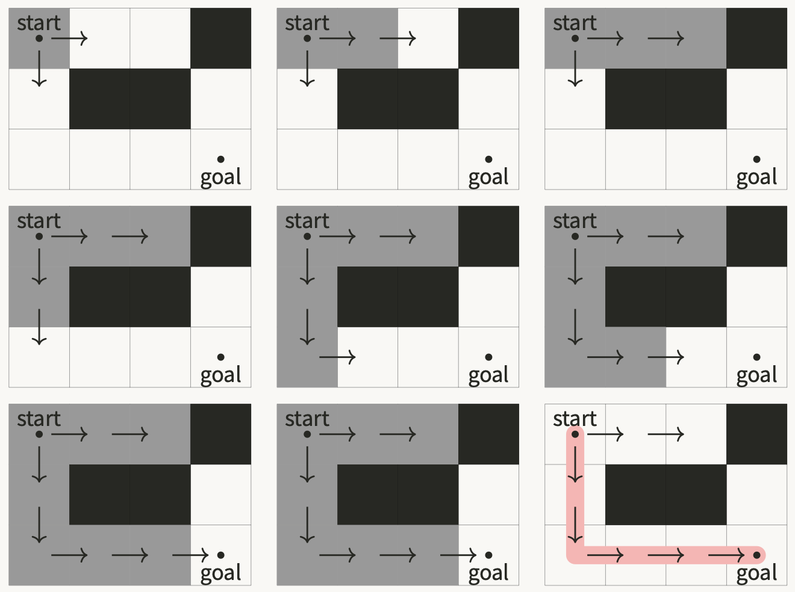
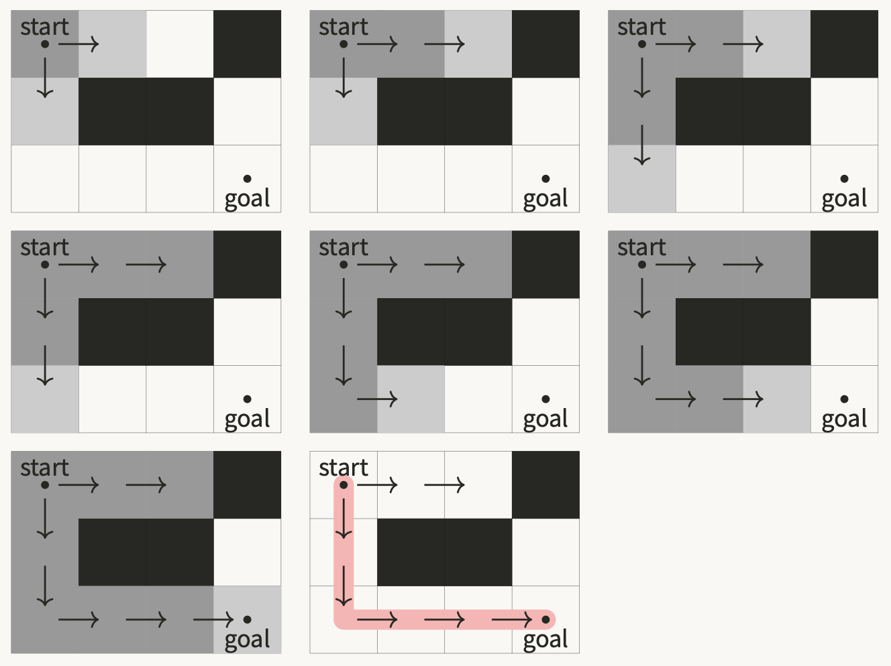
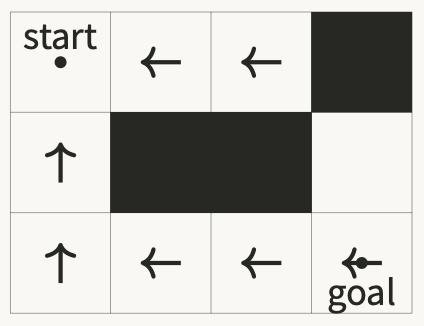
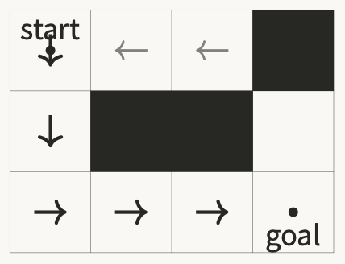

# Assignment 3 - 🔍 Search

- 💯 **Worth**: 7%
- 📅 **Due**: Posted on Moodle
- 🙅🏽‍ **Penalty**: Late submissions lose 10% per day to a maximum of 3 days. Nothing is accepted after 3 days and a grade of 0% will be given.

## 🎯 Objectives

- **Implement** a depth-first search algorithm using a stack data structure.
- **Implement** a breadth-first search algorithm using a queue data structure.

## 🔍 Search

You must solve the following problem, called _search_. Given a terrain, a grid of cells with free spaces and obstacles (walls), is it possible to move from a start position to a goal position. If it is possible, what is a _path_, or the sequence of moves, from the start to the goal?

Search algorithms use a systematic method of visiting cells, by proceeding according to the rules of movement. Here, we can move one cell at a time in the `UP`, `DOWN`, `LEFT` and `RIGHT` directions. Search will proceed until the goal is found, or there is no more cells that can be reached from the start using these moves. If search finds the goal, we say that it's _reachable_ and the algorithm outlines a path, or sequence of moves, to reach the goal.

We will used two search algorithms: _depth-first_ search and _breadth-first_ search.

To assist in searching, the terrain supports cell "coloring", which means assigning a color to a cell indicating it's status in the search.

- A cell marked `WHITE` is unvisited.
- A cell marked `BLACK` is visited.
- A cell marked `GREY` is seen, but not yet visited (breadth-first search only).

### Depth-first Search (DFS)

Starting from the **start** cell, the first strategy is to visit each of the cells in the following way, called _depth-first_. This search strategy continues in one direction until there is nowhere else to go. It then goes back the way it came, called _backtracking_, and tries the next available direction with the same strategy. It's
behaviour can be modelled with a `Stack`.

**Depth-first visit.** Perform the following:

1. Color the current cell `BLACK` (visited).
2. From the current cell, start in the UP direction.
3. If the cell in this direction is either:
   - off the terrain,
   - a wall, or
   - colored `BLACK`,

   then skip this direction.
4. Otherwise, visit this cell by moving to it and immediately depth-first visit it.
5. Repeat this action of skipping or visiting until you have tried all directions, proceeding clockwise,
from the current cell.
6. **Backtrack** by returning back way you originally moved into the current position.

The following sequence of terrains show a DFS step-by-step:

### Breadth-first Search

Starting from the **start** cell, the second strategy is to visit each of the cells in the following way, called a _breadth first_. Cell is visited in the order they are discovered, so the search strategy expands outwards from the starting cell in layers, like an onion. For example, the search will visit all cells 2 moves from the start before visiting cells that are 3 moves from the start. It's behaviour can be modelled with a `Queue`.

**Breadth-first visit.** Perform the following:

1. Color the current cell `BLACK` (visited).
2. From the current cell, start in the UP direction.
3. If the cell in this direction is either:
   - off the terrain,
   - a wall, or
   - colored `BLACK` or `GREY`,

   then skip this direction.
4. Otherwise, move in this direction, color it `GREY` (seen), and immediately backtrack to the current cell.
5. Repeat this until for all directions, proceeding clockwise.
6. Go back, in turn, to each cell you have seen, but not visited (i.e.: `GREY`), since the beginning of the search. Do this in the order you discovered them, and breadth-first visit them.

The following sequence of terrains show a BFS step-by-step:

## 📍 Paths

If a search successfully finds the goal cell from the start cell, we want to demonstrate the path from the start the goal. A convenient algorithm to accomplish this is the following.

1. During your search, record, for each visited cell, the direction of the cell that lead to it during search, called its from direction. For example, in the above example using BFS/DFS this would be:

   

2. Starting at the at the goal, work backwards towards the start by following the from directions.
3. At each cell, record the to direction as the opposite of the from direction.

   

At the end of the process, the path can be followed from the start to the goal by following the **to** directions.