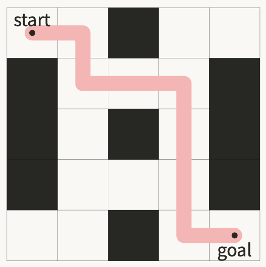

# Assignment 3 - 🔍 Search

- 💯 **Worth**: 7%
- 📅 **Due**: Posted on Moodle
- 🙅🏽‍ **Penalty**: Late submissions lose 10% per day to a maximum of 3 days. Nothing is accepted after 3 days and a grade of 0% will be given.

## 🎯 Objectives

- **Implement** a depth-first search algorithm using a stack data structure.
- **Implement** a breadth-first search algorithm using a queue data structure.

## 🔍 Search

You must solve the following problem, called _search_. Given a terrain, a grid of cells with free spaces and obstacles (walls), is it possible to move from a start position to a goal position. If it is possible, what is a _path_, or the sequence of moves, from the start to the goal?



Search algorithms use a systematic method of visiting cells, by proceeding according to the rules of movement. Here, we can move one cell at a time in the `UP`, `DOWN`, `LEFT` and `RIGHT` directions. Search will proceed until the goal is found, or there is no more cells that can be reached from the start using these moves. If search finds the goal, we say that it's _reachable_ and the algorithm outlines a path, or sequence of moves, to reach the goal.

We will used two search algorithms: _depth-first_ search and _breadth-first_ search.

To assist in searching, the terrain supports cell "coloring", which means assigning a color to a cell indicating it's status in the search.

- A cell marked `WHITE` is unvisited.
- A cell marked `BLACK` is visited.
- A cell marked `GREY` is seen, but not yet visited (breadth-first search only).

### Depth-first Search (DFS)

Starting from the **start** cell, the first strategy is to visit each of the cells in the following way, called _depth-first_. This search strategy continues in one direction until there is nowhere else to go. It then goes back the way it came, called _backtracking_, and tries the next available direction with the same strategy. It's
behaviour can be modelled with a `Stack`.

**Depth-first visit.** Perform the following:

1. Color the current cell `BLACK` (visited).
2. From the current cell, start in the UP direction.
3. If the cell in this direction is either:
   - off the terrain,
   - a wall, or
   - colored `BLACK`,

   then skip this direction.
4. Otherwise, visit this cell by moving to it and immediately depth-first visit it.
5. Repeat this action of skipping or visiting until you have tried all directions, proceeding clockwise,
from the current cell.
6. **Backtrack** by returning back way you originally moved into the current position.

The following sequence of terrains show a DFS step-by-step:


### Breadth-first Search

Starting from the **start** cell, the second strategy is to visit each of the cells in the following way, called a _breadth first_. Cell is visited in the order they are discovered, so the search strategy expands outwards from the starting cell in layers, like an onion. For example, the search will visit all cells 2 moves from the start before visiting cells that are 3 moves from the start. It's behaviour can be modelled with a `Queue`.

**Breadth-first visit.** Perform the following:

1. Color the current cell `BLACK` (visited).
2. From the current cell, start in the UP direction.
3. If the cell in this direction is either:
   - off the terrain,
   - a wall, or
   - colored `BLACK` or `GREY`,

   then skip this direction.
4. Otherwise, move in this direction, color it `GREY` (seen), and immediately backtrack to the current cell.
5. Repeat this until for all directions, proceeding clockwise.
6. Go back, in turn, to each cell you have seen, but not visited (i.e.: `GREY`), since the beginning of the search. Do this in the order you discovered them, and breadth-first visit them.

The following sequence of terrains show a BFS step-by-step:


## 📍 Paths

If a search successfully finds the goal cell from the start cell, we want to demonstrate the path from the start the goal. A convenient algorithm to accomplish this is the following.

1. During your search, record, for each visited cell, the direction of the cell that lead to it during search, called its from direction. For example, in the above example using BFS/DFS this would be:

   

2. Starting at the at the goal, work backwards towards the start by following the from directions.
3. At each cell, record the to direction as the opposite of the from direction.

   

At the end of the process, the path can be followed from the start to the goal by following the **to** directions.

## 🐣 Starter

I have given you a starter with a significant amount of code in it! Here's some advice on how to start working on this assignment.

1. Understand the problem and how the algorithms should work, based on the examples in class and ones you can come up with.
2. Run the starter and try the random search on the different terrains. The `main()` method will show you all the configurations I've setup: there's one per terrain file and a random terrain. The random search will sometimes succeed and sometimes fail depending on luck.
3. Take a look at how the class `RandomSearch` in implemented. Use the class documentation in the doc/folder to help to understand how the relevant classes work.
4. Notice that in verbose more, setting a color prints out the entire color "grid", this can be helpful when tracing your search.
5. Add `DFS` and `BFS` classes that implement the `Search` superclass (see below for an overview of the design). You should use `RandomSearch` as a starting point.
6. To run your search algorithm:
   - We need a way to tell my program about your search algorithms. Add a case to the switch statement in the method `getAlgorithmByName()` in the `Config` class. I have left a TODO comment in that file you can uncomment.
   - Change the algorithm used in the fileres/global.properties. Now from the menu all the terrains will be evaluated with your algorithm.

## 📐 Design Overview

Implement the two search algorithm described in the previous sections within the classes I've given you.
The API documentation for these classes can be found in thedocdirectory of the starter. JavaDoc was
used to document the API and generate these HTML pages[^1].

### Package `terrain`

The `terrain` package contains classes to represent a search problem.

- The primary class is the `Terrain`, used to load and represent the 2D grid with its walls, its initial starting point and its goal. There are some helpful methods to examine parts of the terrain, ex: `isWall()`.
- Each "cell" in the terrain is represented by a `Location`. This is your primary way of tracking where you are in the terrain.
- From a location, you can examine adjacent locations using the `Direction` enumeration.

Here are how these classes relate to each other with some of their methods:


### Package `search`

Each of the two algorithms will be implemented in their own class, `DFS` and `BFS`, that extends a superclass `Search`. The `Search` class has:

- A `solve()` method that is meant to be overridden.
- Methods useful to record colors during search.
- "Verbose" printing for tracing search.

Here are how these classes relate to each other with some of their methods:


### Package `collections`

Collections `Stack<T>` and `Queue<T>` are from the course, along with associated exception classes and
interfaces.

The class `SparseArray<T>` represents an array where many locations are unused. This can be used to store key/value pairs where the key is a `Location`. Using this class is **not necessary** as there are many other ways to keep track of locations that have been visited - totally up to you!


## 📝 Requirements

Your program _must_ meet the following requirements:

1. Meet all pre-conditions of an operation before it is performed on a class.
2. Both DFS and BFS must extend the superclass Search and override the `solve()` method.
3. Don't use recursive methods in your solution.
4. Indicate which cells were seen (`GREY` in BFS) and which cells were visited (`BLACK`) during search by calling the superclass method `setColorAtLocation()`.
5. For each search algorithm, add it to the static method:

   ```java
   public static Search getAlgorithmByName(String algorithmName) { ... }
   ```

   in Config as is shown in the starter `Config.java` where the TODO comments are.

## 🌿 Git

1. Run `git status` to see a list of files that have changed and are ready to be staged.
2. Run `git add .` to stage all the modified files to be committed. Alternatively, you can add specific files like this: `git add src/DFS.java`.
3. Run `git commit -m "A descriptive message here."` (including the quotes) to commit all the files that were just staged.
4. Run `git push` to push the commit(s) up to GitHub.

It is very important that you commit frequently because:

- If you end up breaking your code, it is easy to revert back to a previous commit and start over.
- It provides a useful log of your work so that you (and your teammates if/when you're on a team) can keep track of the work that was done.

## 📥 Submission

Once you've made your final `git push` to GitHub, here's what you have to do to submit:

1. Retrieve the ID code (SHA) associated with the commit. On GitHub repo page, browse your commits:

   

2. Choose the commit you want to submit:

   

3. Copy the commit ID (SHA)

   

4. Paste this commit ID to the submission dropbox on Moodle.

### Style

Your program should be clear and well commented. It must follow the [420-4P6 Style Checklist](https://moodle.johnabbott.qc.ca/mod/resource/view.php?id=9791).

[^1]: [Javadoc Tool](http://www.oracle.com/technetwork/java/javase/documentation/index-jsp-135444.html)
